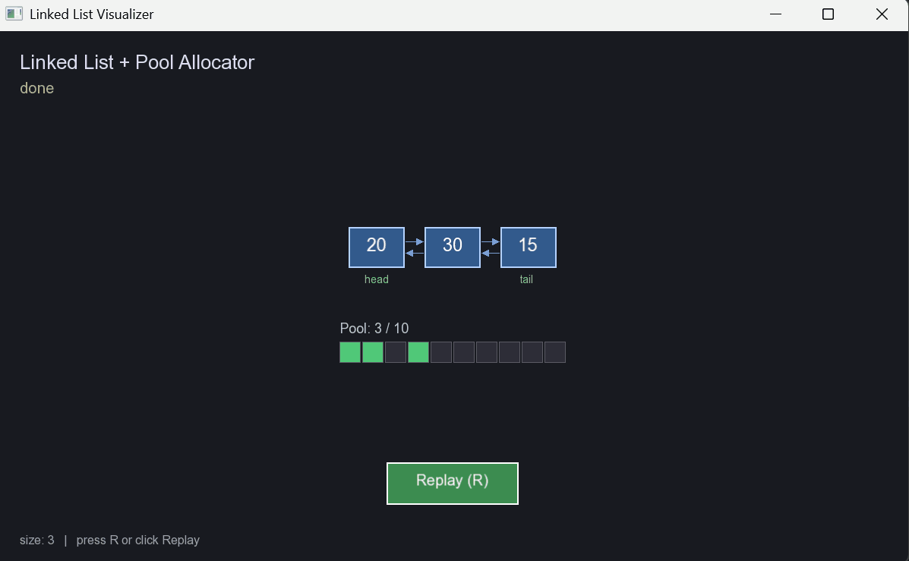

# linkedlist-visualiser

A doubly linked list built from scratch, with a custom node pool allocator and
an SFML visualizer showing insertion, deletion, and pool usage live.

## Build

Requires **MSYS2 UCRT64** with `g++` and the `mingw-w64-ucrt-x86_64-sfml` package.

    pacman -S mingw-w64-ucrt-x86_64-sfml

Build:

    g++ -std=c++17 -g -Wall -Wextra
        src/main.cpp src/LinkedList.cpp src/LinkedList_Pooled.cpp src/NodePool.cpp src/Visualizer.cpp
        -I src -IC:/msys64/ucrt64/include
        -o viz.exe
        -lsfml-graphics -lsfml-window -lsfml-system

Run:

    ./viz.exe

## Benchmarks

To quantify the benefit of the pool allocator, I ran a controlled benchmark
comparing the standard `new`/`delete` linked list against the pooled variant.
The benchmark was split into two phases (insertion and deletion) to observe
allocator's effect independently of traversal cost (O(n²) for deletion.

### Methodology

- **Workload:** 100,000 insertions and 100,000 deletions per trial
- **Trials:** 10 per variant, results averaged (mean, median, min, max)
- **Warm-up:** one unrecorded run to stabilize CPU caches
- **Build:** `g++ -std=c++17 -O2` (release build)
- **Timer:** `std::chrono::high_resolution_clock`
- **Environment:** Windows, MSYS2 UCRT64, g++ 15.2.0

### Results

| Phase  | Variant       | Mean (µs)   | Median (µs) | Min (µs) | Max (µs) |
|--------|---------------|------------:|------------:|---------:|---------:|
| Insert | `new`/`delete` |    2,501.50 |    2,464.00 |    2,304 |    2,734 |
| Insert | Pooled        |      253.20 |      245.00 |      219 |      318 |
| Delete | `new`/`delete` | 11,507,854 | 11,608,461  | 10,914,945 | 11,805,124 |
| Delete | Pooled        |  5,755,069 |  5,748,650  |  5,672,231 |  5,828,695 |

| Phase  | Speedup |
|--------|--------:|
| Insert | **9.88×** |
| Delete | **2.00×** |
| Overall | **2.00×** |

### Interpretation

**Insert (9.88×).** This is a direct measure of the benefits of pooling, which
is mainly for allocation and deallocation. Non-pooled insertion is ~25 ns per 
node, which is essentially all malloc overhead. On the other hand, the pooled 
variant averages ~2.5 ns per operation, an entire 10x gap.

**Deletion (2.00× speedup).** Speedup dropped here, and it took me a minute to 
figure out why. `deleteValue` scans the list every call, so deleting 100k items
from a list of 100k elements requires roughly 5 billion pointer hops (O(n²)). 
This walk is identical for both variants, so it dilutes the allocator's
advantage.

The remaining 2× is what I found most interesting. The pool allocates all nodes 
from a single contiguous array, so a traversal through them is cache-friendly: 
consecutive nodes are likely on the same cache line or at least the same page. 
The non-pooled variant's nodes are individually `malloc`'d and scattered across 
the heap, causing cache misses on most hops. The 2× difference is the cost of 
that memory locality.

**Overall.** The two-phase result is more informative than the combined number. 
Pool allocation is most useful for high-frequency short-lived operations — 
spawning bullets, particles, and events — where the allocator cost is the 
workload. In workloads dominated by traversal (like this benchmark's delete 
phase), the allocator matters less than memory layout.

### Implication for games

The pooled allocator eliminates the per-operation cost of `malloc`/`free` by
reusing a pre-allocated block of nodes. This delivers two benefits relevant to
real-time systems such as games:

1. **Speed** — allocation and deallocation become O(1) pointer operations on a
   free list, with no system allocator involved.   
2. **Predictability** — the max/mean spread narrows from 11.8/11.5 s (2.6%) to
   5.83/5.76 s (1.3%), meaning frame times are less likely to spike and are more
   consistent.

### Reproducing

Benchmarks are in `benchmark.cpp`. To build and run them you'll need to comment 
out `main` in `main.cpp` first to prevent linker errors.

    g++ -std=c++17 -O2 bench/benchmark.cpp src/LinkedList.cpp \
        src/LinkedList_Pooled.cpp src/NodePool.cpp -I src -o build/benchmark
    ./build/benchmark

Two consecutive runs on the same machine produced consistent speedups of
9.88× / 2.00× and 10.42× / 1.99×, indicating the measurements are stable.
